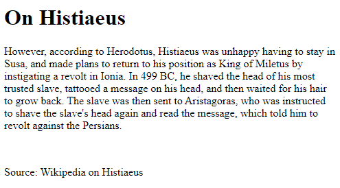
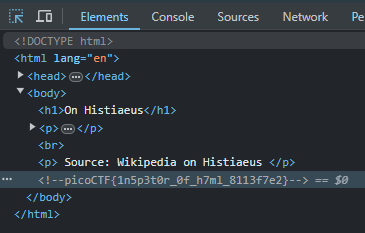

# [Inspect HTML [Web Exploitation] [100 Points]](http://saturn.picoctf.net:55153/) #

## Description ##
Can you get the flag?
Go to this [website](https://play.picoctf.org/practice/challenge/275?category=1&originalEvent=70&page=1) and see what you can discover.

## Hints ##
1. What is the web inspector in web browsers?

## Solution ##

### Step 1: Open website in browser ###

### Step 2: Inpect page. ###
* `Ctrl+shift+C` to inspect web page elements.

### Step 3: Retrieve flag using Kali Linux terminal. ###
* `curl "http://saturn.picoctf.net:55153/" | grep -oE "picoCTF{.*}" | tee >(xsel -b)` to retrieve and copy flag to clipboard
  * `curl` retrieves the contents of the url
  * `-o` flag tells grep to only print the matching part of the line and not the entire line.
  * `-E` flag enables extended regular expressions, allowing the use of the {.*} syntax.
  * `"picoCTF{.*}"` is the regular expression pattern being searched for. It matches strings that start with "picoCTF{" and end with "}". The .* part matches any characters in between.

* **Result**: `picoCTF{1n5p3t0r_0f_h7ml_8113f7e2}`
