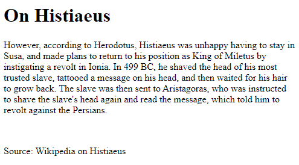
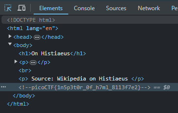

# Inspect HTML [Web Exploitation] [100 Points] #

## Description ##
Can you get the flag?
Go to this [website](https://play.picoctf.org/practice/challenge/275?category=1&originalEvent=70&page=1) and see what you can discover.

## Hints ##
1. What is the web inspector in web browsers?

## Solution ##

### Step 1: Open website in browser ###

### Step 2: Inpect page. ###
`Ctrl+shift+C` to inspect web page elements.

* **Result**: `picoCTF{1n5p3t0r_0f_h7ml_8113f7e2}`
