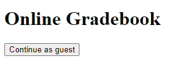
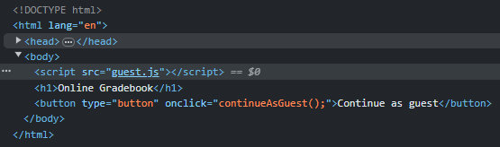
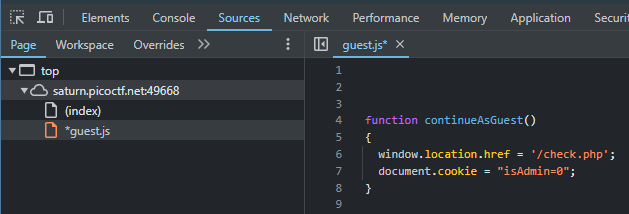
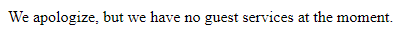
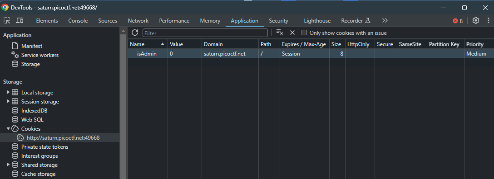
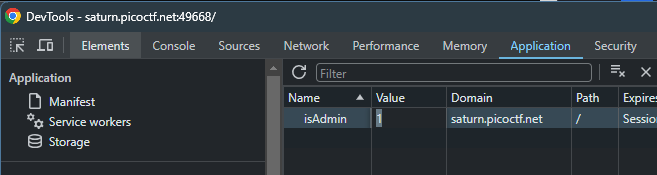
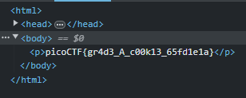
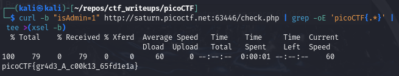

# [Power Cookie [Web Exploitation] [200 Points]](https://play.picoctf.org/practice/challenge/288?category=1&originalEvent=70&page=1) #

## Description ##
Can you get the flag?

Go to this [website](http://saturn.picoctf.net:49668/) and see what you can discover.

## Hints ##
1. Do you know how to modify cookies?

## Solution ##

### Step 1: Description ###

OPTION 2: Via Kali Linux Terminal

    curl -b "isAdmin=1" http://saturn.picoctf.net:63446/check.php | grep -oE 'picoCTF{.*}' | tee >(xsel -b)
* https://www.warp.dev/terminus/curl-with-cookies
  

* **Result**:

      picoCTF{gr4d3_A_c00k13_65fd1e1a}
