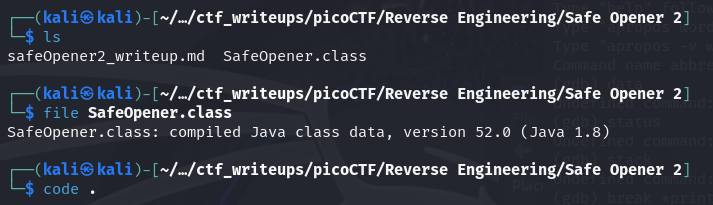
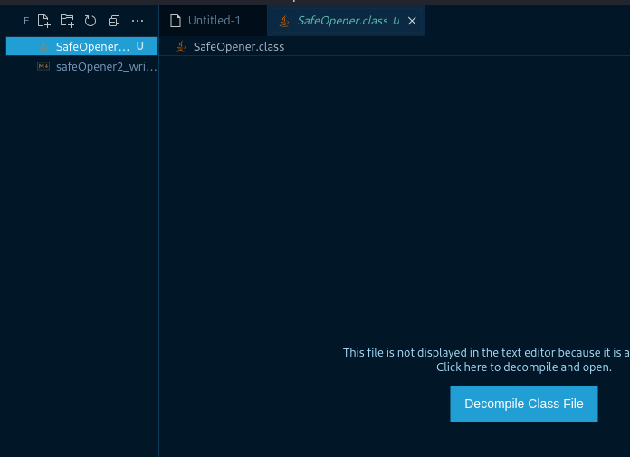
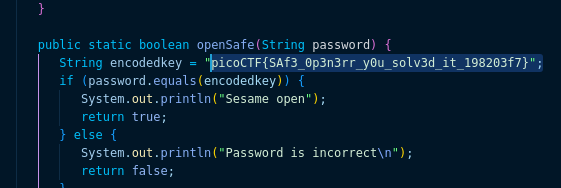

# [Safe Opener 2 [Reverse Engineering] [100 Points]](https://play.picoctf.org/practice/challenge/375?category=3&originalEvent=72&page=1) #

## Description ##
What can you do with this file?
I forgot the key to my safe but this [file](https://artifacts.picoctf.net/c/291/SafeOpener.class) is supposed to help me with retrieving the lost key. Can you help me unlock my safe?

## Hints ##
1. Download and try to decompile the file.
   
## Solution ##

