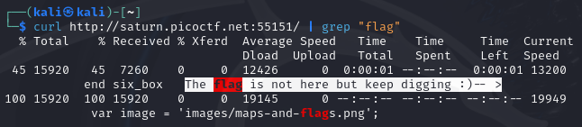

# [Roboto Sans [Web Exploitation] [200 Points]](https://play.picoctf.org/practice/challenge/291?category=1&originalEvent=70&page=1) #

## Description ##
The flag is somewhere on this web application not necessarily on the website. 
Find it.
Check [this](http://saturn.picoctf.net:56615/) out.

## Hints ##

## Solution ##

### Step 1: Description ###

    curl http://saturn.picoctf.net:55151/ | grep "flag"

### Step 1: Description ###

    curl http://saturn.picoctf.net:55151/robots.txt

    curl http://saturn.picoctf.net:55151/robots.txt | grep -oE "a.*==" | base64 -d | tee >(xsel -b)

    curl http://saturn.picoctf.net:55151/js/myfile.txt

* **Result**:

         picoCTF{Who_D03sN7_L1k5_90B0T5_718c9043}
