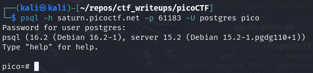
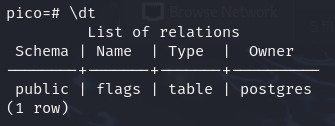
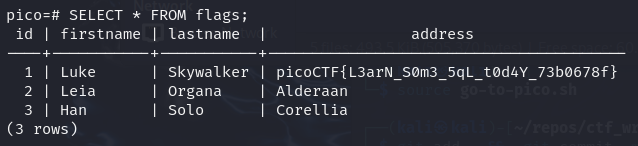
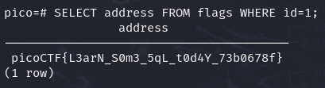

# [SQL Direct [Web Exploitation] [200 Points]](https://play.picoctf.org/practice/challenge/303?category=1&originalEvent=70&page=1) #

## Description ##
Connect to this PostgreSQL server and find the flag!

`psql -h saturn.picoctf.net -p 60560 -U postgres pico`

Password is `postgres`

## Hints ##
1. What does a SQL database contain?

## Solution ##

### Step 1: Description ###
    psql -h saturn.picoctf.net -p 61183 -U postgres pico

    \dt

    SELECT * FROM flags;

    SELECT address FROM flags WHERE id=1;

**Result**:

    picoCTF{L3arN_S0m3_5qL_t0d4Y_73b0678f}
