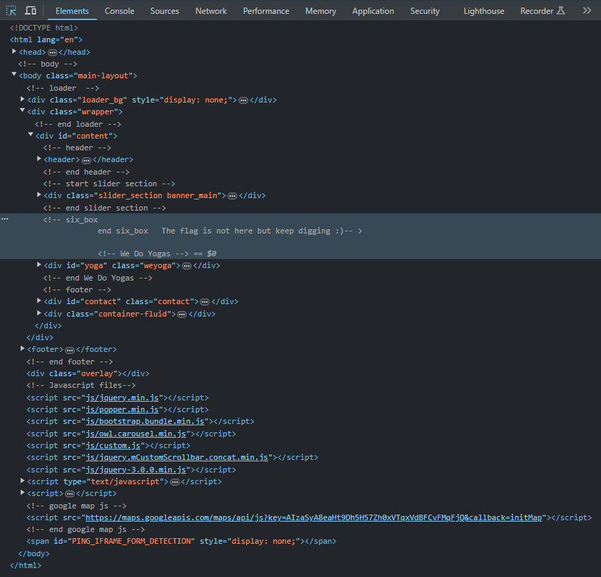
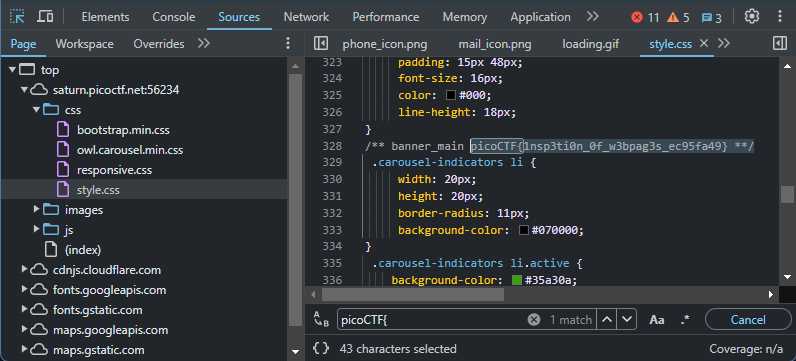
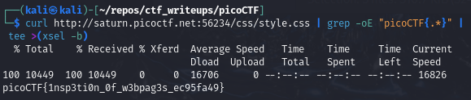

# [Search source [Web Exploitation] [100 Points]](https://play.picoctf.org/practice/challenge/295?category=1&originalEvent=70&page=1) #

## Description ##
The developer of this website mistakenly left an important artifact in the website source, can you find it?

The website is [here](http://saturn.picoctf.net:54888/)

## Hints ##
1. How could you mirror the website on your local machine so you could use more powerful tools for searching?

## Solution ##

### Step 1: Description ###

    curl http://saturn.picoctf.net:56234/css/style.css | grep -oE "picoCTF{.*}" | tee >(xsel -b)
    

* **Result**:

      picoCTF{1nsp3ti0n_0f_w3bpag3s_ec95fa49}
