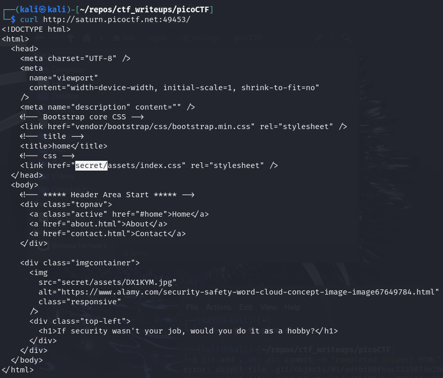
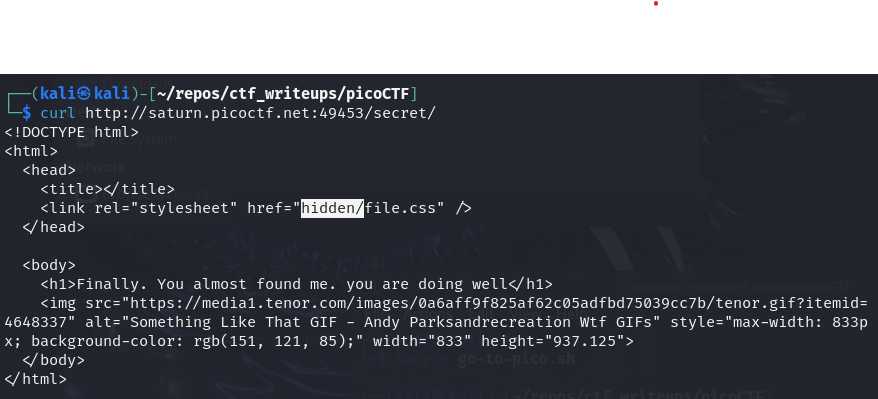
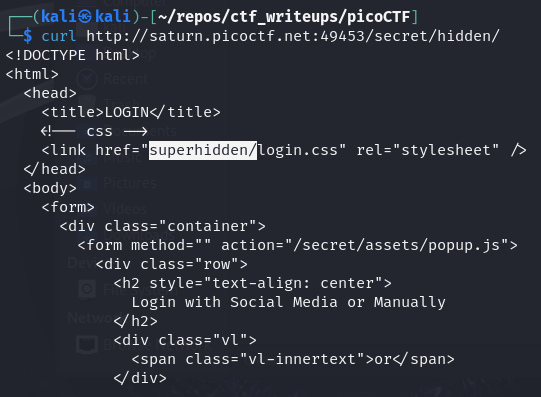
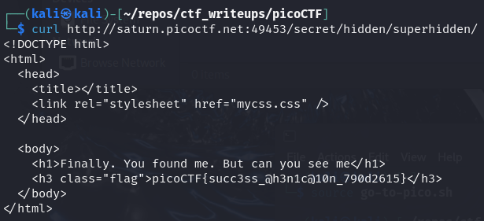
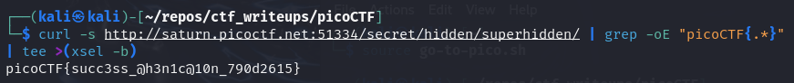

# [Secrets [Web Exploitation] [200 Points]](https://play.picoctf.org/practice/challenge/296?category=1&originalEvent=70&page=1) #

## Description ##
We have several pages hidden. 

Can you find the one with the flag?

The website is running here.

## Hints ##
1. folders folders folders

## Solution ##

### Step 1: Description ###

    curl http://saturn.picoctf.net:49453/

    curl http://saturn.picoctf.net:49453/secret/

    curl http://saturn.picoctf.net:49453/secret/hidden/
    

    curl http://saturn.picoctf.net:49453/secret/hidden/superhidden/

    
    curl -s http://saturn.picoctf.net:51334/secret/hidden/superhidden/ | grep -oE "picoCTF{.*}" | tee >(xsel -b)

**Result**:

      picoCTF{succ3ss_@h3n1c@10n_790d2615}

