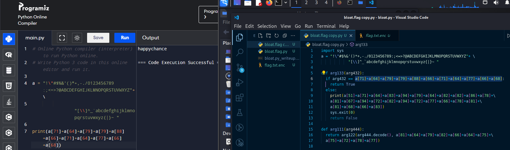
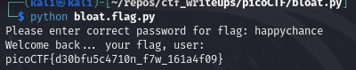

# [bloat.py [Reverse Engineering] [200 Points]](https://play.picoctf.org/practice/challenge/256?category=3&originalEvent=70&page=1) #

## Description ##
Can you get the flag?
Run this [Python program](https://artifacts.picoctf.net/c/104/bloat.flag.py) in the same directory as this [encrypted flag](https://artifacts.picoctf.net/c/104/flag.txt.enc).

## Hints ##

## Solution ##

