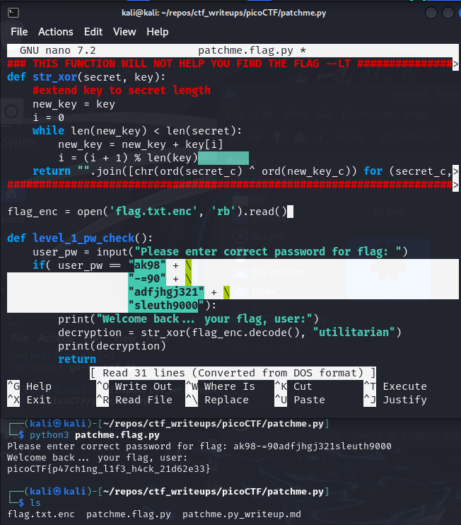
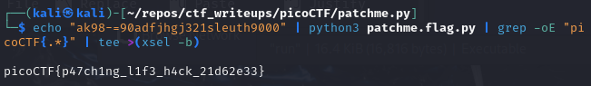

# [patchme.py [Reverse Engineering] [100 Points]](https://play.picoctf.org/practice/challenge/287?category=3&originalEvent=70&page=1&search=) #

## Description ##
Can you get the flag?
Run this Python program in the same directory as this encrypted flag.

## Hints ##

## Solution ##

### Step 1: Description ###

