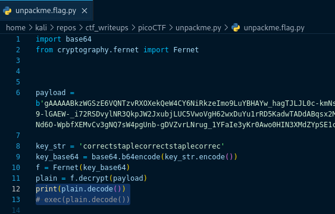

# [unpackme.py [Reverse Engineering] [100 Points]](https://play.picoctf.org/practice/challenge/314?category=3&originalEvent=70&page=1) #

## Description ##
Can you get the flag?
Reverse engineer this [Python program](https://artifacts.picoctf.net/c/49/unpackme.flag.py).

## Hints ##

## Solution ##

